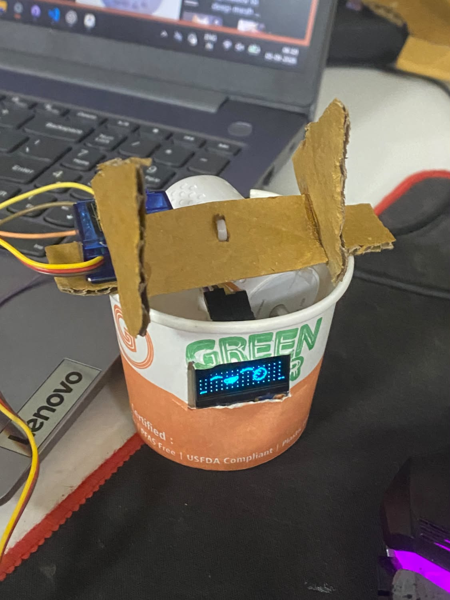
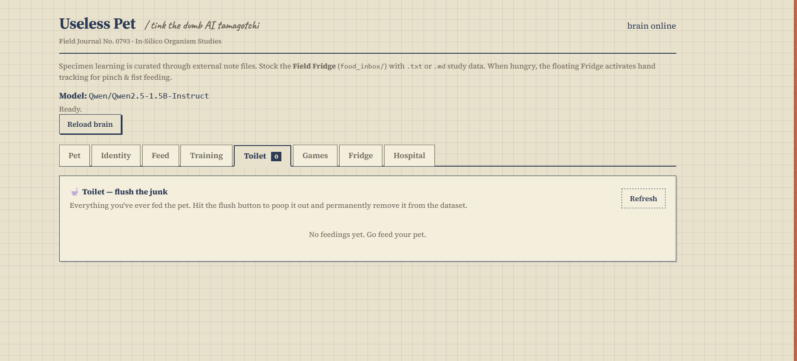
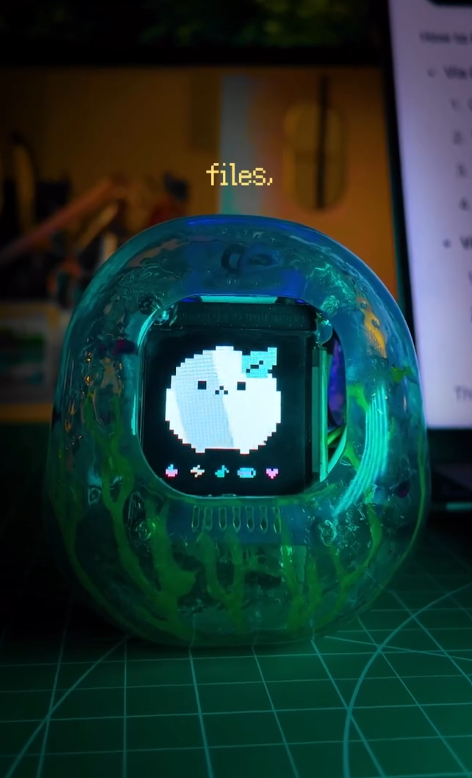

# Useless Pet — Tink the Dumb AI Tamagotchi 🎯

## Basic Details

### Team Name: Solo

### Team Members

- Team Lead: Muhammed Ameen - Jain Kochi
### Project Description

Useless Pet is a delightfully unnecessary AI Tamagotchi called Tink. It lives as a floating desktop companion, learns from the notes you feed it, and can inhabit a physical ESP32-powered body with an OLED face, servo movement, and touch response.

It runs locally with Ollama, so Tink can develop opinions about your study notes without sending its tiny thoughts to the cloud.

### The Problem (that doesn't exist)

Study notes are tragically under-petted. They sit in folders all day with nobody to chew them, digest them for 60 seconds, and react emotionally to quantum mechanics.

### The Solution (that nobody asked for)

We built Tink: a needy desktop-and-hardware creature that eats `.txt` and `.md` notes from a pixel fridge, remembers what it has learned, asks strange questions, and occasionally needs comfort from a physical touch sensor.

## Technical Details

### Technologies/Components Used

For Software:

- Languages: Python, HTML, CSS, JavaScript, C++/Arduino
- Frameworks: FastAPI, Uvicorn, PySide6, FreeRTOS
- Libraries: Ollama, PySerial, MediaPipe, OpenCV, Adafruit GFX, Adafruit SSD1306
- Tools: Arduino IDE, ESP32 board support, Python 3.10+, Git

For Hardware:

- ESP32 development board
- 128×64 SSD1306/SH1106 I2C OLED display
- Servo motor (GPIO 13)
- Capacitive, analog, or digital touch sensor (GPIO 32)
- USB cable and an optional external 5 V supply for the servo

### Implementation

For Software:

#### Installation

1. Install [Python 3.10+](https://www.python.org/downloads/) and [Ollama](https://ollama.com).
2. Pull the local model:

```bash
ollama pull smallthinker:latest
```

3. Create a virtual environment and install dependencies:

```powershell
python -m venv .venv
.\.venv\Scripts\Activate.ps1
pip install -r requirements.txt
```

#### Run

Run the complete Windows experience:

```powershell
.\start_all.bat
```

Or launch only the dashboard:

```powershell
.\start.bat
```

Then open `http://127.0.0.1:7860`. To connect the physical pet after flashing it, use the ESP32 Hardware dashboard tab or run `start_bridge.bat`.

For Hardware:

1. Open `firmware/esp32_pet/esp32_pet.ino` in Arduino IDE.
2. Install **Adafruit GFX** and **Adafruit SSD1306** (or Adafruit SH110X for an SH1106 display).
3. Select an ESP32 board and its COM port, then upload the sketch.

## Project Documentation

For Software:

### Screenshots



*The notebook-inspired dashboard provides pet, identity, feed, training, toilet, games, fridge, and hospital controls.*



*The ESP32-powered body renders Tink’s animated expressions on its OLED screen.*


*An early physical prototype combines the enclosure, servo mechanism, wiring, and OLED display.*

### Diagrams

```text
Study notes (.txt / .md)
          │
          ▼
 Golden Pixel Fridge ──► Pet Brain + FastAPI dashboard ──► Ollama (local AI)
          │                         │
          ▼                         ▼
 Floating desktop Tink ◄──── USB serial bridge ────► ESP32 body
                                                      ├─ OLED face (GPIO 21/22)
                                                      ├─ Servo (GPIO 13)
                                                      └─ Touch sensor (GPIO 32)
```

*Notes fed to Tink drive the local AI brain and dashboard; the ESP32 mirrors Tink’s mood with physical movement, an animated face, and touch interactions.*

For Hardware:

### Schematic & Circuit

| Component | ESP32 pin | Connection |
| --- | --- | --- |
| OLED VCC / GND | `3V3` / `GND` | Power |
| OLED SDA / SCL | `GPIO 21` / `GPIO 22` | I2C data / clock |
| Servo signal | `GPIO 13` | 50 Hz PWM; constrained to 0°–70° |
| Touch sensor | `GPIO 32` | Capacitive, analog, or digital input |

*The firmware uses ESP32 dual-core FreeRTOS: one core keeps servo and touch response smooth while the other renders the OLED and receives serial data.*

### Build Photos


*The OLED is the physical face; it receives expressions such as hungry, crying, blushing, and happy.*


*The build places the ESP32, OLED, wiring, and servo-driven parts inside a compact recycled-material enclosure.*

## Project Demo

### Video

[Watch YEMI in action on Instagram](https://www.instagram.com/reel/Dc47Gciy1hc/?utm_source=ig_web_copy_link&igsi=MzRlODBiNWFlZA==)

*The reel demonstrates the project’s physical AI-pet concept in action.*

### Additional Demos

- Launch `start_all.bat` to try the floating pet and dashboard locally.
- Open `firmware/esp32_pet/README.md` for ESP32 flashing and wiring details.

## Team Contributions

- [Add name]: [Add specific contribution]
- [Add name]: [Add specific contribution]
- [Add name]: [Add specific contribution]

---

Made with ❤️ at TinkerHub Useless Projects


